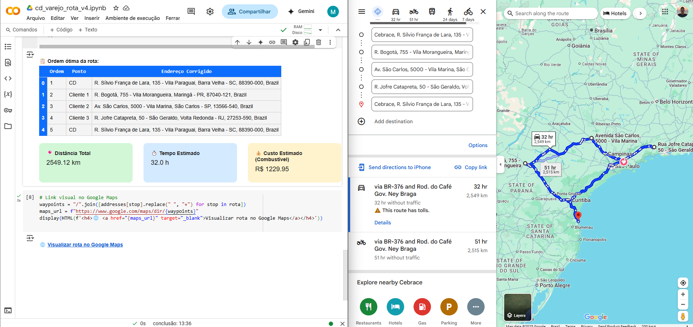

# 🚛 CD Varejo – Otimização de Rota com Google Maps API (v5)

Este projeto permite otimizar rotas logísticas com base em endereços reais utilizando Python, Google Maps e IA como copiloto técnico.

## 🔍 Funcionalidades

- Entrada interativa de endereços (CD e clientes)
- Validação de endereços com a **Google Geocoding API**
- Otimização de rota via **Google Distance Matrix API**
- Cálculo de KPIs:
  - 📍 Distância total
  - ⏱️ Tempo estimado
  - 💰 Custo baseado em consumo (Km/L) e preço do combustível
- Link direto para visualização da rota real no Google Maps

---

## ⚠️ Sobre a API Key

Este projeto utiliza serviços do Google Maps, e **você precisará da sua própria chave de API**.

🎯 Para gerar:
1. Vá até https://console.cloud.google.com
2. Crie um projeto e ative as APIs:
   - Geocoding API
   - Distance Matrix API
3. Em "Credenciais", gere sua chave e **não compartilhe publicamente**

> No notebook, a chave será solicitada de forma segura ao rodar o código.

---

## ▶️ Execute no Google Colab

[](https://colab.research.google.com/github/alvs-mat/cd-varejo-otimizacao-rota/blob/main/cd%20varejo%20-%20otimiza%C3%A7%C3%A3o%20de%20rota%20v5.ipynb)

---

## 📸 Exemplo



---

## 📦 Requisitos

```bash
pip install googlemaps pandas ipywidgets
```

Ou use o `requirements.txt` incluído.

---

## 📬 Contato

Desenvolvido por [Mateus Alves](https://www.linkedin.com/in/seu-perfil/)  
Sinta-se à vontade para contribuir ou compartilhar!

